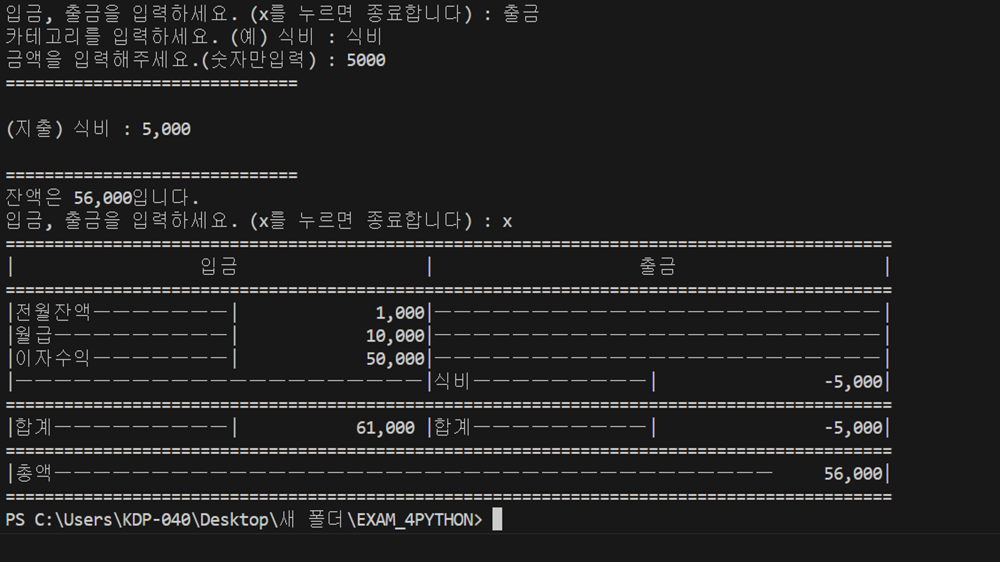

## 1주차

## 🗒️ 세부 내용

- **Python** 학습을 목표로 함
- Python을 이용하여 가계부 프로그램 구현

---

## 👨🏻‍💻 담당 파트

- 가계부 프로그램 제작

---

## 💡 결론 및 보완점

- Python의 기본적인 문법(반복문, 조건문)을 이용해 가계부 프로그램을 완성하였음
- 가계부 수정 기능을 추가한다면 좋을 것으로 판단됨

---
